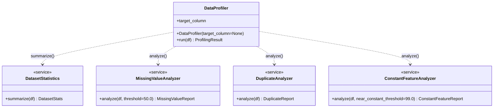
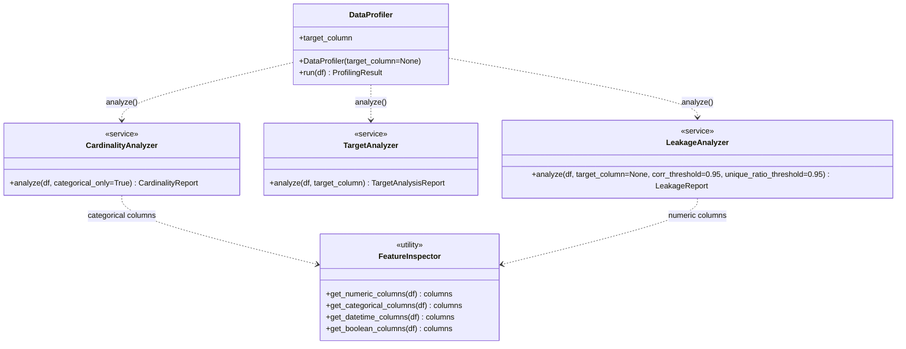
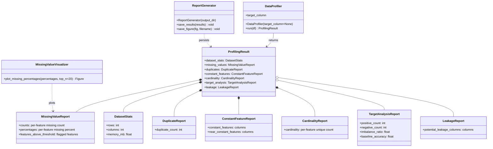

# Data Profiling & Quality Analysis Checklist

## Implemented class diagram

**How to read this diagram**

- `+` denotes a public attribute or method.
- `<<service>>` marks stateless analysis/reporting classes; `<<utility>>` marks helper classes.
- Method signatures show the main inputs and, where relevant, default argument values.
- `..>` indicates a dependency or usage relationship.
- `*--` indicates strong ownership/composition inside `ProfilingResult`; `o--` indicates optional contained results.
- Read the flow from `DataProfiler` outward: it coordinates analyzers, assembles a `ProfilingResult`, and that result is later consumed by reporting and visualization helpers.

## Dataset Understanding
- Load dataset
- Dataset dimensions
- Feature types
- Target variable distribution
- Memory consumption

## Data Quality
- Missing value analysis
- Duplicate row analysis
- Constant feature detection
- Near-constant feature detection
- Unique value analysis
- High cardinality detection

## Statistical Analysis
- Numerical feature summary
- Categorical feature summary
- Target-wise summary

## Class Imbalance Analysis
- Class distribution
- Imbalance ratio
- Baseline majority class accuracy

## Data Leakage Detection
Data leakage occurs when information from outside the training dataset is used to create the model. This can lead to overly optimistic performance during training and poor performance in production.

Our profiling framework implements a `LeakageAnalyzer` that flags potential leakage based on two criteria:

1.  **ID-like Column Detection**: Features that have an extremely high ratio of unique values to total rows (e.g., > 95%). These are often primary keys (like `SK_ID_CURR`) or unique identifiers that shouldn't be used as predictive features.
2.  **High Target Correlation**: Numeric features that exhibit an exceptionally high absolute correlation with the target variable (e.g., > 0.95). While high correlation is generally good, extreme values often indicate that the feature is a proxy for the target or is recorded after the target event has occurred.

Features flagged by this analyzer should be manually reviewed before being included in the training pipeline.

- Suspicious columns
- ID columns
- Features highly correlated with target

## Visualization
- Missing value heatmap
- Missing value percentages
- Target distribution
- Numerical feature distributions
- Correlation matrix

## Reporting
- Generate profiling report
- Save plots
- Save quality metrics
- Save summary report