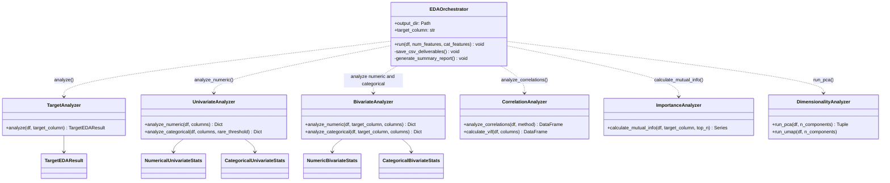
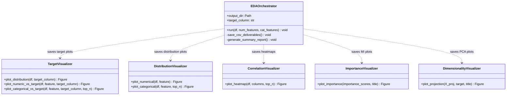

# Phase 3 Checklist

## Implemented class diagram






---

## Section 1 — Target Analysis

Goal:

Understand how the target is distributed.

### Checklist

* [ ] Target class counts
* [ ] Target percentages
* [ ] Baseline accuracy
* [ ] Baseline precision
* [ ] Baseline recall
* [ ] Baseline F1

---

### Plots

* [ ] Countplot
* [ ] Pie chart (optional)

---

### Why

Later we need to evaluate:

```text
Did the model beat the baseline?
```

---

# Section 2 — Univariate Analysis

Goal:

Understand each feature individually.

---

## Numerical Features

### Statistics

* [ ] Mean
* [ ] Median
* [ ] Std
* [ ] Min
* [ ] Max
* [ ] Skewness
* [ ] Kurtosis

---

### Visualizations

* [ ] Histogram
* [ ] KDE
* [ ] Boxplot
* [ ] Violin plot

---

### Questions

* Is distribution normal?
* Is feature heavily skewed?
* Does transformation help?

---

## Categorical Features

### Statistics

* [ ] Cardinality
* [ ] Top categories
* [ ] Rare categories

---

### Visualizations

* [ ] Countplot

---

### Questions

* Is one category dominant?
* Are there sparse categories?

---

# Section 3 — Target Relationship Analysis

This is one of the most valuable sections.

Goal:

Understand which features separate classes.

---

## Numerical vs Target

### Visualizations

* [ ] Boxplot by target
* [ ] Violin plot by target
* [ ] Distribution overlay

Example:

```text
AMT_INCOME_TOTAL
```

Target=0

vs

Target=1

---

### Metrics

* [ ] Mean difference
* [ ] Median difference
* [ ] Cohen's D
* [ ] Mutual Information

---

### Questions

* Do defaults earn less?
* Do defaults have larger loans?

---

## Categorical vs Target

### Visualizations

* [ ] Stacked bar chart
* [ ] Target rate chart

---

### Metrics

* [ ] Target rate per category
* [ ] Chi-square score
* [ ] Mutual information

---

### Questions

* Which occupations default more?
* Which organizations default more?

---

# Section 4 — Correlation Analysis

Goal:

Understand relationships between features.

---

## Numerical Correlations

### Metrics

* [ ] Pearson
* [ ] Spearman

---

### Visualizations

* [ ] Correlation heatmap

---

### Questions

* Highly correlated features?
* Redundant features?

---

## Target Correlations

### Outputs

Top:

```text
Positive correlations
Negative correlations
```

---

### Why

Potential feature importance signals.

---

# Section 5 — Multicollinearity Analysis

Goal:

Detect redundant information.

---

### Metrics

* [ ] Variance Inflation Factor (VIF)

---

### Questions

* Which features are nearly duplicates?
* Should some be removed?

---

# Section 6 — Outlier Analysis

Critical for tabular ML.

---

### Visualizations

* [ ] Boxplots
* [ ] Scatter plots

---

### Metrics

* [ ] IQR outliers
* [ ] Z-score outliers

---

### Questions

* Genuine outliers?
* Data errors?
* Need transformation?

---

# Section 7 — Missing Value Pattern Analysis

Phase 2 measured missingness.

Now we analyze it.

---

### Questions

* Missing completely at random?
* Missing related to target?
* Missing related to another feature?

---

### Visualizations

* [ ] Missing value matrix
* [ ] Missingness correlation heatmap

---

### Why

Can influence imputation strategy later.

---

# Section 8 — Feature Importance Exploration

Without training final models.

---

## Mutual Information

Compute:

```python
mutual_info_classif()
```

---

### Outputs

Top predictive features.

---

### Why

Early signal.

Not final feature selection.

---

# Section 9 — Dimensionality Reduction

Goal:

See if classes separate naturally.

---

## PCA

### Plots

* [ ] PCA 2D

---

### Questions

* Any natural clusters?

---

## UMAP

### Plots

* [ ] UMAP projection

---

### Questions

* Are defaults clustered?

---

# Section 10 — Class Imbalance Investigation

Goal:

Understand how imbalance affects feature distributions.

---

### Compare

Target=0

vs

Target=1

for:

* [ ] Top numerical features
* [ ] Top categorical features

---

### Questions

* Minority class concentrated in certain regions?

---

# Section 11 — Feature Engineering Opportunities

This is where EDA becomes useful.

For each feature:

Record:

```text
Feature
Observation
Potential Action
```

Example:

| Feature          | Observation      | Action           |
| ---------------- | ---------------- | ---------------- |
| AMT_INCOME_TOTAL | Heavy right skew | Log transform    |
| DAYS_EMPLOYED    | Extreme outliers | Cap values       |
| OCCUPATION_TYPE  | Rare categories  | Group categories |

---
