# Phase 4 Goal

## Implemented class diagram

```mermaid
classDiagram
    class PreprocessingPipeline {
        +config: pipeline config
        +reports_dir: Path
        +target_column: str
        +steps_: configured steps
        +fit(X, y) PreprocessingPipeline
        +transform(X) DataFrame
        +fit_transform(X, y) DataFrame
        +get_feature_names_out() feature names
    }

    class SchemaValidator {
        +fit(df) SchemaValidator
        +validate(df, is_train) validation report
    }

    class LeakageValidator {
        +analyze(df) leakage report
    }

    class MetadataTracker {
        +log_step(step_name, input_cols, output_cols, elapsed_time) void
        +log_shapes(input_shape, output_shape) void
        +record_missing_values(report) void
        +record_outliers(report) void
        +record_encodings(report) void
        +record_scaling(report) void
        +record_feature_metadata(metadata) void
        +save_all_reports() void
    }

    class BaseTransformer {
        +fitted_: bool
        +fit(X, y) BaseTransformer
        +transform(X)
        +get_feature_names_out(input_features) feature names
    }

    class DataCleaner
    class MissingValueTransformer
    class RareCategoryTransformer
    class EncodingTransformer
    class OutlierTransformer
    class FeatureTransformer
    class FeatureScaler

    BaseTransformer <|-- DataCleaner
    BaseTransformer <|-- MissingValueTransformer
    BaseTransformer <|-- RareCategoryTransformer
    BaseTransformer <|-- EncodingTransformer
    BaseTransformer <|-- OutlierTransformer
    BaseTransformer <|-- FeatureTransformer
    BaseTransformer <|-- FeatureScaler

    PreprocessingPipeline *-- SchemaValidator
    PreprocessingPipeline *-- LeakageValidator
    PreprocessingPipeline *-- MetadataTracker
    PreprocessingPipeline o-- DataCleaner : optional step
    PreprocessingPipeline o-- MissingValueTransformer : optional step
    PreprocessingPipeline o-- RareCategoryTransformer : optional step
    PreprocessingPipeline o-- EncodingTransformer : optional step
    PreprocessingPipeline o-- OutlierTransformer : optional step
    PreprocessingPipeline o-- FeatureTransformer : optional step
    PreprocessingPipeline o-- FeatureScaler : optional step
```



The concrete transformer sequence is assembled from the YAML configuration through
`src/preprocessing/registry.py`, so the same pipeline class can build linear,
tree-based, and neural-network preprocessing variants without changing code.

For a reusable ML experimentation framework, Phase 4 should focus on building a **generic preprocessing pipeline framework** rather than just preprocessing the Home Credit dataset.

Convert raw features into model-ready features while ensuring:

* No data leakage
* Reproducibility
* Extensibility
* Experimentability
* Compatibility with multiple models

The output of this phase should be:

```text
Raw Dataset
    ↓
Cleaning
    ↓
Missing Value Handling
    ↓
Encoding
    ↓
Scaling
    ↓
Outlier Treatment
    ↓
Feature Transformations
    ↓
Processed Dataset
```

---

# Deliverables

```text
data/

├── raw/
├── interim/
├── processed/
│
├── feature_metadata.json
├── preprocessing_report.json
└── transformation_report.json
```

---

# Phase 4 Checklist

---

# Section 1 — Schema Validation

Before cleaning anything.

## Objectives

Validate assumptions.

### Checklist

* [ ] Validate required columns exist
* [ ] Validate target column exists
* [ ] Validate data types
* [ ] Validate duplicate column names
* [ ] Validate column uniqueness

---

## Why

Future datasets may drift.

Example:

```text
AMT_CREDIT
```

becomes

```text
credit_amount
```

Pipeline should fail early.

---

# Section 2 — Data Type Standardization

Goal:

Normalize datatypes.

---

### Numerical

Convert:

```python
int64
float64
```

appropriately.

---

### Categorical

Convert:

```python
object
```

to:

```python
category
```

---

### Datetime

Detect and convert.

---

### Checklist

* [ ] Numerical standardization
* [ ] Categorical standardization
* [ ] Datetime parsing

---

# Section 3 — Duplicate Handling

---

### Row Duplicates

* [ ] Detect duplicates
* [ ] Remove duplicates

---

### Feature Duplicates

Detect:

```text
Feature A == Feature B
```

---

### Checklist

* [ ] Row duplicate removal
* [ ] Duplicate feature detection

---

# Section 4 — Missing Value Handling

One of the most important sections.

---

## Missing Value Analysis Output

Use Phase 2 insights.

---

### Numerical Features

Implement strategies:

* [ ] Mean
* [ ] Median
* [ ] Constant value
* [ ] KNN imputation
* [ ] Iterative imputation

---

### Categorical Features

Implement:

* [ ] Most frequent
* [ ] Unknown category

---

### Missing Indicators

Create:

```text
EXT_SOURCE_1_missing
```

---

### Checklist

* [ ] Missing value report
* [ ] Missing indicators
* [ ] Configurable imputers

---

# Section 5 — Rare Category Handling

Very common in real-world datasets.

---

Example:

```text
Occupation:
    Astronaut -> 3 samples
```

---

### Strategies

* [ ] Group into OTHER
* [ ] Frequency threshold
* [ ] Top-K categories

---

### Checklist

* [ ] Rare category detector
* [ ] Rare category encoder

---

# Section 6 — Encoding Framework

Critical for reuse.

Don't hardcode one encoding strategy.

---

## Encoders to Support

### One-Hot

* [ ] OneHotEncoder

---

### Ordinal

* [ ] OrdinalEncoder

---

### Target Encoding

* [ ] Cross-validation safe implementation

---

### Frequency Encoding

* [ ] Frequency encoder

---

### CatBoost Encoding

* [ ] CatBoost encoder

---

### Checklist

* [ ] Encoder registry
* [ ] Config-driven encoder selection

---

# Section 7 — Outlier Treatment

Not all models need it.

Neural networks usually benefit more than boosting methods.

---

## Detection Methods

* [ ] IQR
* [ ] Z-score
* [ ] Isolation Forest

---

## Treatment Methods

* [ ] Clipping
* [ ] Winsorization
* [ ] Removal

---

### Checklist

* [ ] Outlier detector
* [ ] Outlier treatment module

---

# Section 8 — Feature Transformations

EDA will tell us where needed.

---

### Transformations

* [ ] Log Transform
* [ ] Box-Cox
* [ ] Yeo-Johnson
* [ ] Square Root

---

### Example

```text
AMT_INCOME_TOTAL
```

likely needs:

```python
np.log1p()
```

---

### Checklist

* [ ] Transformation registry
* [ ] Feature-specific transforms

---

# Section 9 — Scaling Framework

Not required for all models.

---

### Supported Scalers

* [ ] StandardScaler
* [ ] MinMaxScaler
* [ ] RobustScaler
* [ ] QuantileTransformer

---

### Important

Tree models:

```text
No scaling
```

Neural networks:

```text
Scaling required
```

---

### Checklist

* [ ] Scaler registry
* [ ] Configurable scaling

---

# Section 10 — Leakage Prevention

Extremely important.

---

### Rules

Fit preprocessing only on:

```text
Training Fold
```

Never:

```text
Entire Dataset
```

---

### Checklist

* [ ] Fit/Transform separation
* [ ] Train/Test isolation
* [ ] CV-safe preprocessing

---

# Section 11 — Metadata Tracking

Most people skip this.

---

For every transformation store:

```json
{
  "feature": "AMT_INCOME_TOTAL",
  "operation": "log_transform",
  "parameters": {}
}
```

---

### Checklist

* [ ] Transformation metadata
* [ ] Versioning

---

# Section 12 — Pipeline Composition Framework

This is probably the most important engineering task.

Instead of:

```python
clean()
impute()
encode()
scale()
```

build reusable transformers.

---

Example:

```python
pipeline = [
    MissingValueTransformer(),
    RareCategoryTransformer(),
    TargetEncoder(),
    RobustScaler()
]
```

---

Later:

```python
pipeline.fit(X_train)

pipeline.transform(X_test)
```

---

# Suggested Project Structure

```text
src/

├── preprocessing/
│
├── transformers/
│   ├── base.py
│   ├── missing.py
│   ├── encoding.py
│   ├── scaling.py
│   ├── outliers.py
│   ├── transformations.py
│   └── rare_categories.py
│
├── validators/
│   ├── schema.py
│   └── leakage.py
│
├── pipeline/
│   ├── preprocessing_pipeline.py
│   └── registry.py
│
└── metadata/
    └── tracking.py
```

---

# What We Should Produce At End Of Phase 4

### Dataset Outputs

```text
processed/
```

containing model-ready features.

---

### Reports

```text
reports/

├── preprocessing_report.json
├── missing_value_report.json
├── encoding_report.json
├── outlier_report.json
└── scaling_report.json
```

---

### Reusable Objects

```python
PreprocessingPipeline
```

```python
MissingValueTransformer
```

```python
TargetEncoder
```

```python
RareCategoryTransformer
```

```python
FeatureScaler
```

```python
TransformationRegistry
```

---

One adjustment I would make for this project: since you want to compare **Logistic Regression, XGBoost, LightGBM, CatBoost, and Neural Networks**, do **not** create a single preprocessing pipeline.

Create **model-specific preprocessing pipelines**:

```text
TreeBasedPipeline
    - imputation
    - encoding
    - no scaling

LinearPipeline
    - imputation
    - encoding
    - scaling

NeuralNetworkPipeline
    - imputation
    - encoding
    - scaling
    - additional normalization
```

This mirrors how production ML systems are typically organized and will make the later experimentation phases much cleaner.
